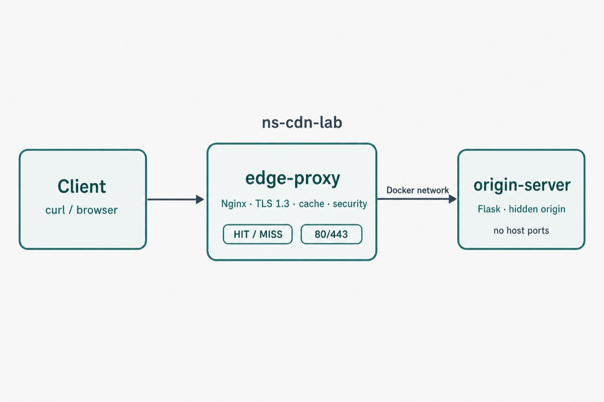

# ns-cdn-lab

Local CDN lab for learning and demos — Nginx in front of a hidden Flask origin.

[](LICENSE)
[](https://github.com/neeraj542/edgeforge-lab-networking/actions/workflows/ci.yml)

> Educational Docker stack only — not a production CDN. See [docs/production-notes.md](docs/production-notes.md).

## What you get

- HTTPS locally (TLS 1.3)
- Cache `HIT` / `MISS` via `X-Cache-Status`
- Origin cloaking (Flask not exposed on the host)
- Basic edge security: method filter, bad UA block, rate limit
- One-command test suite

## Quick start

Needs Docker Compose v2, free ports 80/443, `curl`, and `openssl`.

```bash
git clone https://github.com/neeraj542/edgeforge-lab-networking.git
cd edgeforge-lab-networking
make up
make test
```

Expected: **10 passed / 0 failed**.

```bash
curl -Ik --resolve ns-cdn-lab.local:443:127.0.0.1 https://ns-cdn-lab.local/
```

## How it works

<p align="center">
  
</p>

| Service | Role |
|---------|------|
| `edge-proxy` | Nginx — TLS, cache, security |
| `origin-server` | Flask demo origin (no host ports) |

## Docs

- Beginner: [Getting Started](docs/getting-started.md) · [Concepts](docs/concepts.md)
- Intermediate: [Architecture](docs/architecture.md) · [Caching](docs/caching.md) · [Security](docs/security.md)
- Apply: [Use Cases](docs/use-cases.md) · [Examples](docs/examples.md)
- Expert: [Extending](docs/extending.md) · [Production notes](docs/production-notes.md)
- Stuck?: [Troubleshooting](docs/troubleshooting.md)

Full index: [docs/README.md](docs/README.md)

## Make targets

| Command | What it does |
|---------|--------------|
| `make up` | Certs + build + start |
| `make test` | Run verification suite |
| `make logs` | Tail edge + origin logs |
| `make reload` | Reload Nginx config |
| `make down` | Stop containers |
| `make clean` | Stop and wipe cache |
| `make example-static` | Static-site cache example |
| `make example-api` | API cache / bypass example |
| `make example-byo` | Point at a host app |

## License

Apache 2.0 — [LICENSE](LICENSE) · [NOTICE](NOTICE)

## Contributing

[CONTRIBUTING.md](CONTRIBUTING.md) · [ROADMAP.md](ROADMAP.md) · [SECURITY.md](SECURITY.md)
